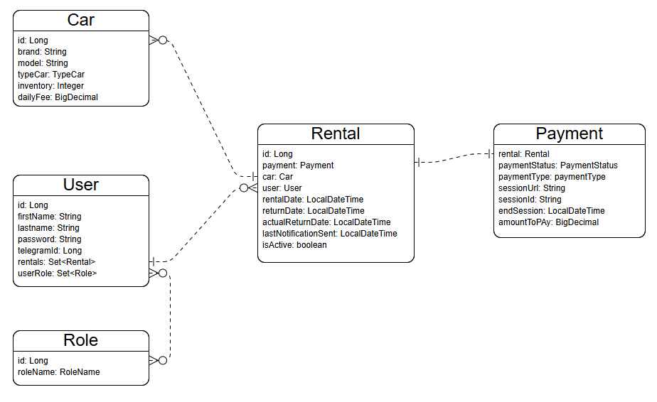

# Car Sharing Service

A program for buying books. To use the program, you must first register and log in. You will have a shopping cart where you can add books and specify the quantity. You can also complete your purchase, view the total cost, and enter a shipping address.

---
## Tech Stack

- **Java 17**
- **Spring Boot 3.5.13**
- **MySql 9.5.0**
- **Mapstruct 1.5.5.Final**
- **Liquibase 4.31.1**
- **JWT Auth**
- **Telegram bots 9.5.0**
- **Stripe 32.1.0**
---
## API Reference
**After launching the application, you can view all endpoints at the link**\
http://localhost:8080/swagger-ui/index.html
```
  User registration and login api: /auth
```
| Method | Endpoint | Description                         |
|:-------|:---------|:------------------------------------|
| `POST` | `/auth/registration` | **Registration new user**|
| `POST` | `/auth/login` | **Authenticate user** |

```
  Car api: /cars
```
| Method   | Endpoint      | Description                      |
|:---------|:--------------|:---------------------------------|
| `GET`    | `/cars`      | **Get all cars**                 |
| `GET`    | `/cars/{id}` | **Detail car information by id** |
| `POST`   | `/cars`      | **Create new car**               |
| `PUT`    | `/cars/{id}` | **Update car**                   |
| `DELETE` | `/cars/{id}` | **Delete car by id**             |
```
  Category api: /rentals
```
| Method   | Endpoint               | Description                       |
|:---------|:-----------------------| :-------------------------------- |
| `GET`    | `/rentals`             | **Show rentals detail information by user** |
| `POST`    | `/rentals/{id}/return` | **Set actual return date** |
| `POST`   | `/rentals`             | **Create new rental** |
```
  Shopping cart api: /payments
```
| Method   | Endpoint         | Description                       |
|:---------|:-----------------| :-------------------------------- |
| `GET`    | `/payments`      | **Show all payments by user** |
| `POST`   | `/payments/{id}` | **Create payment by rental id** |

---
## Entities Structure


---

## Launching the application

1. Create a folder, go to it and save the project using the link\
https://github.com/dayren86/car-sharing-sevice.git \
or command:
```aiignore
  git clone https://github.com/dayren86/car-sharing-sevice.git
```
2. Create a .env file and fill in [Environment Variables](#environment-variables)
3. Create Jar file
```
  mvn clean package
```
4. Launch the app
```
  mvn spring-boot:run
```

## Environment Variables

To run this project, you will need to add the following environment variables to your .env file\
```
APPLICATION_NAME=

**Main database settings**
DATABASE_NAME=
DATABASE_USER=
DATABASE_PASSWORD=

**Security JWT authorization**
JWT_EXPIRATION=
JWT_SECRET=

**Telegram token**
TELEGRAM_TOKEN=

**Stripe payment system**
STRIPE_SECRET_KEY=
STRIPE_WEBHOOK_SECRET=

**Scheduler config**
PAYMENT_SCHEDULER_INTERVAL=
RENTAL_SCHEDULER_INTERVAL=
RENTAL_SCHEDULER_MESSAGE_REPEAT=

**Docker config**
**Should match the variables above when running locally**
MYSQLDB_DATABASE=$DATABASE_NAME
MYSQLDB_ROOT_LOGIN=$DATABASE_USER
MYSQLDB_ROOT_PASSWORD=$DATABASE_PASSWORD

**Ports for forwarding (Local Port -> Docker Port)**
MYSQLDB_LOCAL_PORT=
MYSQLDB_DOCKER_PORT=

SPRING_LOCAL_PORT=
SPRING_DOCKER_PORT=
DEBUG_PORT=
```

---
## Postman collection
[Carscharing.postman.json](Carsharing.postman.json)

